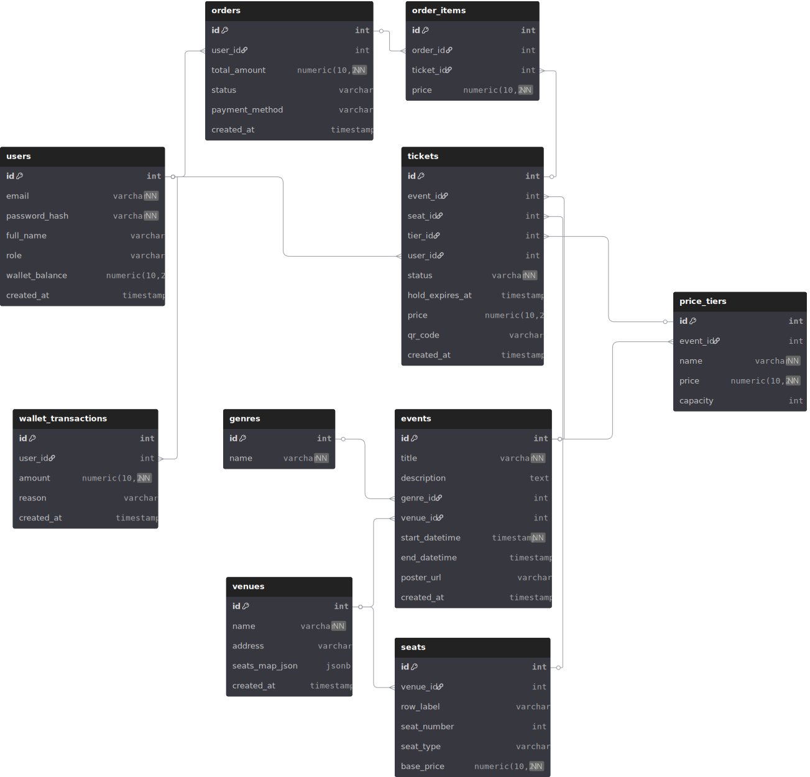

# ITMO Ticket App

## Схема БД

[dbdiagram](https://dbdiagram.io/d/6910d2466735e11170f1bf32)


## Локальный запуск

### 1. Docker (БД + генерация данных)

```bash
# поднять БД + генерация данных
docker-compose up -d db
```

**Postgres порт:** `5432`
**Пользователь/БД:** `myuser / mydatabase`
**Пароль:** `mypassword`

Проверка подключения к БД:

```bash
docker exec -it my_postgres psql -U myuser -d mydatabase
```

### 2. Backend (FastAPI)

```bash
cd backend
python -m venv venv
source venv/bin/activate      # Mac/Linux
venv\Scripts\activate         # Windows
pip install -r requirements.txt

uvicorn main:app --reload --host 0.0.0.0 --port 8000
```

**Проверка:**

```bash
curl http://localhost:8000/health
```

### 3. Frontend (React + TS + Vite)

```bash
cd frontend
npm install
npm run dev
```

**Фронт падает на:** `http://localhost:5173`

### 4. Перезапуск компонентов

```bash
# БД
docker-compose restart db

# Генератор данных
docker-compose run --rm data-generator

# Backend
uvicorn main:app --reload --host 0.0.0.0 --port 8000

# Frontend
npm run dev
```
